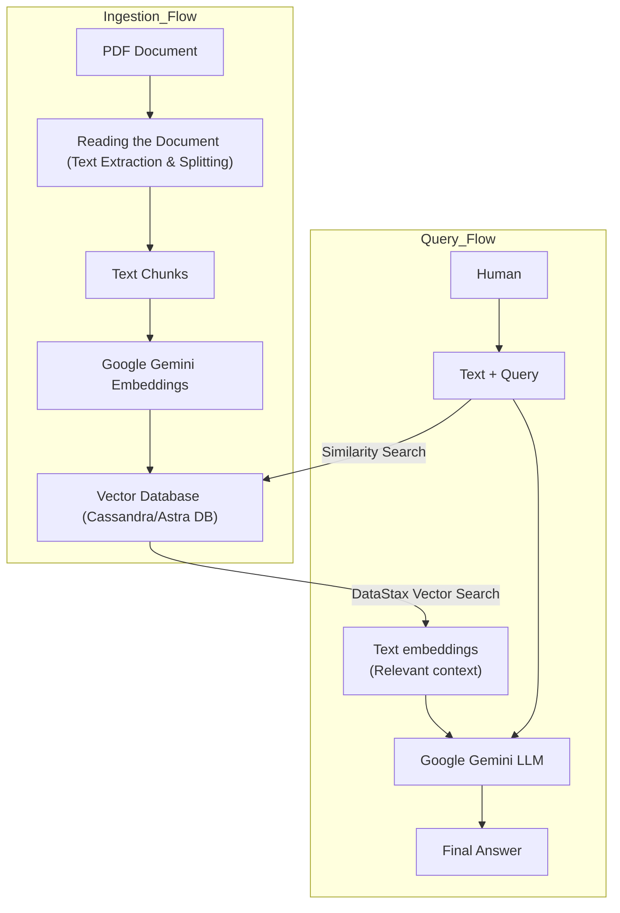

# PDF-Query
A Lang-chain project using Cassandra DB supported by Google Gemini AI model and API. Showcase use RAG pipeline for usage of PDF source for answering the input queries

## Dataflow Diagram



## Setup

1. **Install Dependencies**:
   ```bash
   pip install -r requirements.txt
   ```

2. **Environment Variables**:
   Create a `.env` file based on `.env.example` and add your credentials:
   - `ASTRA_DB_APPLICATION_TOKEN`
   - `ASTRA_DB_ID`
   - `GOOGLE_API_KEY`

## How to Run

Launch the Streamlit application:
```bash
streamlit run app.py
```

## Features
- **Dynamic PDF Upload**: Upload any PDF to query its content.
- **Astra DB Integration**: Powered by DataStax for high-performance vector search.
- **Google Gemini AI**: Uses state-of-the-art models for embeddings and text generation.

# Resources
- [DataStax Astra DB](https://astra.datastax.com/)
- [Google AI Studio](https://aistudio.google.com/)
- [LangChain Documentation](https://python.langchain.com/)
