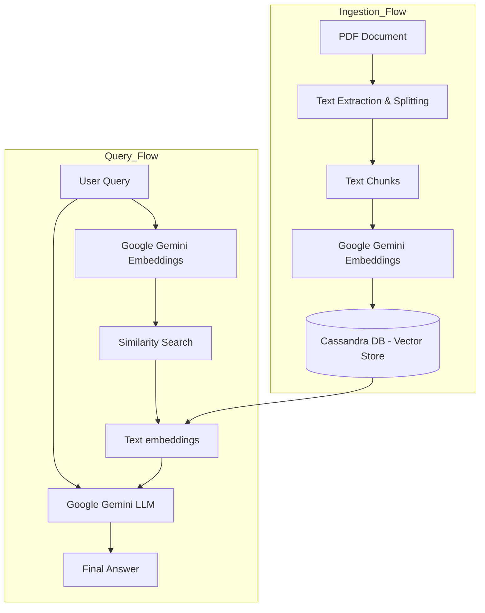

# PDF-Query
A Lang-chain project using Cassandra DB supported by Google Gemini AI model and API. Showcase use RAG pipeline for usage of PDF source for answering the input queries

## Dataflow Diagram

# Resources
- Datastack

